```mermaid
graph TB
    %% Data Sources Layer
    subgraph "Data Sources Layer"
        POS1[POS Terminals<br/>Bank A]
        ATM1[ATM Machines<br/>Bank A]
        MOB1[Mobile Banking<br/>Bank A]
        
        POS2[POS Terminals<br/>Bank B]
        ATM2[ATM Machines<br/>Bank B]
        MOB2[Mobile Banking<br/>Bank B]
        
        POS3[POS Terminals<br/>Bank C]
        ATM3[ATM Machines<br/>Bank C]
        MOB3[Mobile Banking<br/>Bank C]
        
        POS4[POS Terminals<br/>Bank D]
        ATM4[ATM Machines<br/>Bank D]
        MOB4[Mobile Banking<br/>Bank D]
        
        POS5[POS Terminals<br/>Bank E]
        ATM5[ATM Machines<br/>Bank E]
        MOB5[Mobile Banking<br/>Bank E]
    end

    %% Edge Computing Layer (Branch Servers)
    subgraph "Edge Computing Layer - Regional Branch Servers"
        EDGE1[Bank A Branch Server<br/>🏢 Edge Node 1<br/>• Local Preprocessing<br/>• Model Training<br/>• Privacy Preservation]
        EDGE2[Bank B Branch Server<br/>🏢 Edge Node 2<br/>• Local Preprocessing<br/>• Model Training<br/>• Privacy Preservation]
        EDGE3[Bank C Branch Server<br/>🏢 Edge Node 3<br/>• Local Preprocessing<br/>• Model Training<br/>• Privacy Preservation]
        EDGE4[Bank D Branch Server<br/>🏢 Edge Node 4<br/>• Local Preprocessing<br/>• Model Training<br/>• Privacy Preservation]
        EDGE5[Bank E Branch Server<br/>🏢 Edge Node 5<br/>• Local Preprocessing<br/>• Model Training<br/>• Privacy Preservation]
    end

    %% Central Aggregation Layer
    subgraph "Central Aggregation Layer"
        CENTRAL[Central Aggregation Server<br/>☁️ Federated Learning Hub<br/>• FedAvg Algorithm<br/>• Global Model Creation<br/>• Model Distribution<br/>• Privacy Compliance]
    end

    %% Global Model Distribution
    subgraph "Global Model Deployment"
        GLOBAL[Global Fraud Detection Model<br/>🧠 Distributed AI<br/>• Real-time Inference<br/>• Edge Deployment<br/>• Fraud Scoring]
    end

    %% Data Flow - Transaction Data to Edge Servers
    POS1 -->|Transaction Data<br/>Encrypted| EDGE1
    ATM1 -->|Transaction Data<br/>Encrypted| EDGE1
    MOB1 -->|Transaction Data<br/>Encrypted| EDGE1

    POS2 -->|Transaction Data<br/>Encrypted| EDGE2
    ATM2 -->|Transaction Data<br/>Encrypted| EDGE2
    MOB2 -->|Transaction Data<br/>Encrypted| EDGE2

    POS3 -->|Transaction Data<br/>Encrypted| EDGE3
    ATM3 -->|Transaction Data<br/>Encrypted| EDGE3
    MOB3 -->|Transaction Data<br/>Encrypted| EDGE3

    POS4 -->|Transaction Data<br/>Encrypted| EDGE4
    ATM4 -->|Transaction Data<br/>Encrypted| EDGE4
    MOB4 -->|Transaction Data<br/>Encrypted| EDGE4

    POS5 -->|Transaction Data<br/>Encrypted| EDGE5
    ATM5 -->|Transaction Data<br/>Encrypted| EDGE5
    MOB5 -->|Transaction Data<br/>Encrypted| EDGE5

    %% Model Updates - Edge to Central (No Raw Data)
    EDGE1 -.->|Model Weights Only<br/>🔐 Privacy Preserved| CENTRAL
    EDGE2 -.->|Model Weights Only<br/>🔐 Privacy Preserved| CENTRAL
    EDGE3 -.->|Model Weights Only<br/>🔐 Privacy Preserved| CENTRAL
    EDGE4 -.->|Model Weights Only<br/>🔐 Privacy Preserved| CENTRAL
    EDGE5 -.->|Model Weights Only<br/>🔐 Privacy Preserved| CENTRAL

    %% Global Model Distribution - Central to Edge
    CENTRAL ==>|Global Model<br/>FedAvg Aggregated<br/>📡 Broadcast| EDGE1
    CENTRAL ==>|Global Model<br/>FedAvg Aggregated<br/>📡 Broadcast| EDGE2
    CENTRAL ==>|Global Model<br/>FedAvg Aggregated<br/>📡 Broadcast| EDGE3
    CENTRAL ==>|Global Model<br/>FedAvg Aggregated<br/>📡 Broadcast| EDGE4
    CENTRAL ==>|Global Model<br/>FedAvg Aggregated<br/>📡 Broadcast| EDGE5

    %% Global Model Creation and Deployment
    CENTRAL -->|Creates Global Model<br/>🎯 Best Performance| GLOBAL

    %% Real-time Fraud Detection Deployment
    GLOBAL -.->|Real-time Inference<br/>⚡ Edge Deployment| EDGE1
    GLOBAL -.->|Real-time Inference<br/>⚡ Edge Deployment| EDGE2
    GLOBAL -.->|Real-time Inference<br/>⚡ Edge Deployment| EDGE3
    GLOBAL -.->|Real-time Inference<br/>⚡ Edge Deployment| EDGE4
    GLOBAL -.->|Real-time Inference<br/>⚡ Edge Deployment| EDGE5

    %% Real-time Fraud Detection at Source
    EDGE1 -.->|Fraud Alerts<br/>🚨 Real-time| POS1
    EDGE1 -.->|Fraud Alerts<br/>🚨 Real-time| ATM1
    EDGE1 -.->|Fraud Alerts<br/>🚨 Real-time| MOB1

    EDGE2 -.->|Fraud Alerts<br/>🚨 Real-time| POS2
    EDGE2 -.->|Fraud Alerts<br/>🚨 Real-time| ATM2
    EDGE2 -.->|Fraud Alerts<br/>🚨 Real-time| MOB2

    EDGE3 -.->|Fraud Alerts<br/>🚨 Real-time| POS3
    EDGE3 -.->|Fraud Alerts<br/>🚨 Real-time| ATM3
    EDGE3 -.->|Fraud Alerts<br/>🚨 Real-time| MOB3

    EDGE4 -.->|Fraud Alerts<br/>🚨 Real-time| POS4
    EDGE4 -.->|Fraud Alerts<br/>🚨 Real-time| ATM4
    EDGE4 -.->|Fraud Alerts<br/>🚨 Real-time| MOB4

    EDGE5 -.->|Fraud Alerts<br/>🚨 Real-time| POS5
    EDGE5 -.->|Fraud Alerts<br/>🚨 Real-time| ATM5
    EDGE5 -.->|Fraud Alerts<br/>🚨 Real-time| MOB5

    %% Styling
    classDef dataSource fill:#e1f5fe,stroke:#0277bd,stroke-width:2px,color:#000
    classDef edgeServer fill:#f3e5f5,stroke:#7b1fa2,stroke-width:3px,color:#000
    classDef centralServer fill:#fff3e0,stroke:#ef6c00,stroke-width:4px,color:#000
    classDef globalModel fill:#e8f5e8,stroke:#2e7d32,stroke-width:3px,color:#000

    class POS1,ATM1,MOB1,POS2,ATM2,MOB2,POS3,ATM3,MOB3,POS4,ATM4,MOB4,POS5,ATM5,MOB5 dataSource
    class EDGE1,EDGE2,EDGE3,EDGE4,EDGE5 edgeServer
    class CENTRAL centralServer
    class GLOBAL globalModel
```

## System Architecture Components

### 📱 **Data Sources Layer**
- **POS Terminals**: Point-of-sale transaction processing
- **ATM Machines**: Cash withdrawal and banking transactions  
- **Mobile Banking Apps**: Digital payment and transfer transactions

### 🏢 **Edge Computing Layer** 
- **Bank Branch Servers**: Regional federated learning clients
- **Local Processing**: Data preprocessing and model training
- **Privacy Preservation**: Raw data never leaves local premises

### ☁️ **Central Aggregation Layer**
- **FedAvg Algorithm**: Weighted averaging of model parameters
- **Global Model Creation**: Combines knowledge from all branches
- **Model Distribution**: Broadcasts updated models to edge nodes

### 🧠 **Real-time Deployment**
- **Edge Inference**: Local fraud detection at branch level
- **Real-time Alerts**: Immediate fraud notifications
- **Low Latency**: Sub-second transaction processing

## Key Features Represented

### 🔐 **Privacy Preservation**
- Transaction data stays at branch level
- Only model weights shared with central server
- Compliance with financial regulations (PCI DSS, GDPR)

### ⚡ **Edge Computing Benefits**
- Reduced latency for real-time fraud detection
- Lower bandwidth usage (models vs. raw data)
- Improved scalability and reliability

### 🤝 **Collaborative Learning**
- Each branch learns from collective knowledge
- Improved fraud detection through collaboration
- No single point of failure

### 📊 **Federated Learning Process**
1. **Local Training**: Each branch trains on local data
2. **Model Sharing**: Branches send model weights to central server
3. **Global Aggregation**: Central server averages all models using FedAvg
4. **Model Distribution**: Updated global model sent back to all branches
5. **Real-time Deployment**: Global model deployed for fraud detection